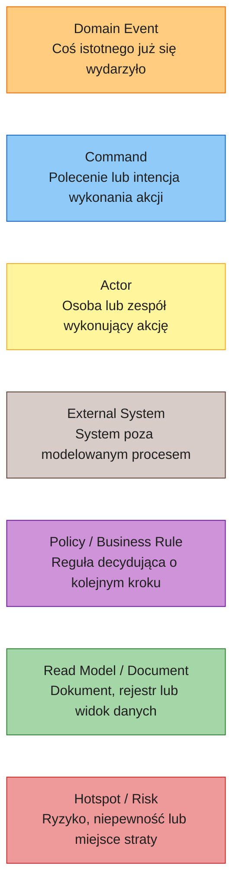
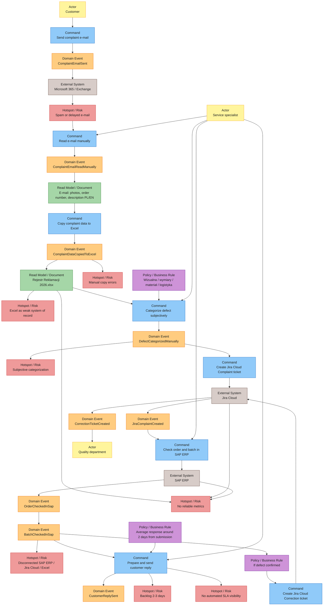

# Event Storming AS-IS

## Cel dokumentu

Ten dokument modeluje obecny proces obsługi reklamacji w Metalpolu. Perspektywa AS-IS pokazuje, że głównym ograniczeniem nie jest brak AI, tylko ręczne łączenie kilku systemów przez specjalistę serwisu.

W obecnym procesie człowiek działa jako integrator między Microsoft 365 / Exchange, Excelem, Jira Cloud, SAP ERP, klientem i działem jakości. To powoduje opóźnienia, błędy przepisywania, niespójną klasyfikację oraz brak wiarygodnych metryk.

## Legenda Event Storming

## Diagram AS-IS

## Sekwencja procesu AS-IS

1. Klient wysyła e-mail z opisem reklamacji, zdjęciem wady i numerem zamówienia. Wiadomość może być po polsku albo po angielsku.
2. E-mail trafia do skrzynki `reklamacje@metalpol.pl`, ale część wiadomości wpada do spamu albo jest czytana z opóźnieniem.
3. Specjalista serwisu ręcznie czyta wiadomość i interpretuje dane z treści e-maila oraz załączników.
4. Specjalista ręcznie przepisuje dane do pliku Excel `Rejestr Reklamacji 2026.xlsx`.
5. Specjalista subiektywnie przypisuje kategorię wady: `wizualna`, `wymiary`, `materiał` albo `logistyka`.
6. Specjalista tworzy ticket `Complaint` w Jira Cloud.
7. Specjalista sprawdza zamówienie i batch w SAP ERP.
8. Specjalista przygotowuje odpowiedź do klienta. Średni czas odpowiedzi wynosi około 2 dni od zgłoszenia.
9. Jeżeli wada zostanie potwierdzona, specjalista tworzy ticket `Correction` w Jira Cloud dla działu jakości.

## Hotspoty i ryzyka

| Hotspot | Gdzie występuje | Skutek biznesowy |
|---|---|---|
| Spam lub opóźniony e-mail | Wejście przez Microsoft 365 / Exchange | Reklamacja może zostać obsłużona z opóźnieniem albo pominięta |
| Błędy ręcznego przepisywania | E-mail -> Excel -> Jira Cloud / SAP ERP | Błędny numer zamówienia, batch, dane klienta lub kategoria |
| Excel jako słaby system of record | Rejestr reklamacji | Brak kontroli wersji, brak audytu zdarzeń, trudny centralny status |
| Subiektywna kategoryzacja | Klasyfikacja wady przez specjalistę | Niespójne raportowanie przyczyn reklamacji |
| Brak wiarygodnych metryk | Excel, Jira Cloud i SAP ERP jako rozproszone źródła | Brak jasnego SLA, backlogu, trendów i obciążenia zespołu |
| Rozłączone SAP ERP / Jira Cloud / Excel | Walidacja orderu, batcha i ticketów | Specjalista musi ręcznie przenosić kontekst między systemami |
| Backlog 2-3 dni | Wysoki wolumen reklamacji | Wydłużony czas odpowiedzi i mniejsza przewidywalność pracy |
| Brak automatycznej widoczności SLA | Cały proces | Management widzi problem dopiero po fakcie |

## Komentarz procesowy

Proces traci czas na wejściu, bo skrzynka e-mail nie jest kontrolowanym mechanizmem intake. Jeżeli wiadomość trafi do spamu albo zostanie przeczytana później, dalsze kroki procesu nie mogą się rozpocząć. Brak automatycznego monitoringu oznacza, że opóźnienie jest wykrywane dopiero wtedy, gdy ktoś ręcznie sprawdzi skrzynkę albo klient ponowi kontakt.

Proces traci jakość danych w momentach ręcznego przepisywania i subiektywnej klasyfikacji. Ten sam e-mail jest interpretowany przez człowieka, przepisywany do Excela, odtwarzany w Jira Cloud i weryfikowany w SAP ERP. Każde przejście między narzędziami zwiększa ryzyko pomyłki oraz utrudnia późniejsze odtworzenie, skąd pochodziła konkretna informacja.

Proces traci widoczność, ponieważ nie ma jednego timeline'u reklamacji ani spójnego event store. Excel, Jira Cloud i SAP ERP przechowują różne fragmenty sprawy, ale nie dają pełnego obrazu SLA, backlogu, czasu pierwszej odpowiedzi, typów wad ani problematycznych partii produkcyjnych. W praktyce management nie ma bieżącego dashboardu, a specjalista serwisu jest jedyną osobą, która zna pełny kontekst operacyjny konkretnej reklamacji.
