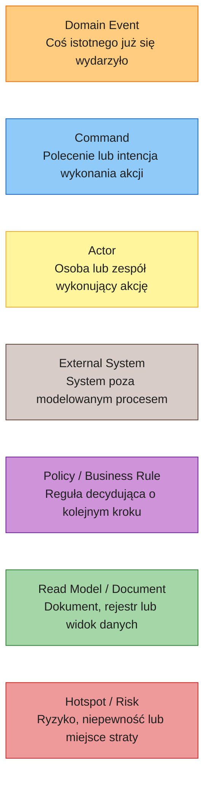
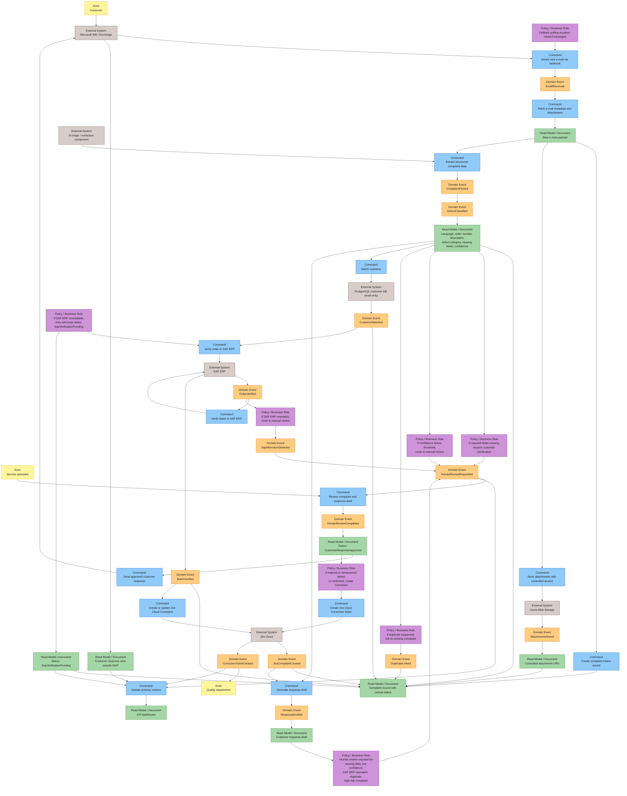

# Event Storming TO-BE

## Cel dokumentu

Ten dokument modeluje docelowy proces obsługi reklamacji po wprowadzeniu kontrolowanej automatyzacji AI. TO-BE nie zakłada magicznego agenta podejmującego decyzje za firmę. Zakłada pipeline, w którym system odpowiada za intake, walidację, integracje, status i metryki, a AI wspiera ekstrakcję danych, klasyfikację, streszczenie i draft odpowiedzi.

Finalne decyzje reklamacyjne pozostają po stronie człowieka lub deterministycznych reguł biznesowych.

## Legenda Event Storming

## Diagram TO-BE

## Sekwencja procesu TO-BE

1. Microsoft 365 / Exchange wykrywa nowy e-mail przez webhook. Fallback polling monitoruje wiadomości, których webhook nie przetworzył.
2. System pobiera metadane e-maila i załączniki.
3. System tworzy rekord intake reklamacji z centralnym identyfikatorem i statusem.
4. Załączniki są zapisywane w Azure Blob Storage z kontrolowanym dostępem, a rekord reklamacji przechowuje tylko bezpieczne URI.
5. Komponent AI wyciąga strukturę danych z e-maila: język, numer zamówienia, opis, kategorię wady, brakujące pola i confidence score.
6. System dopasowuje klienta w wewnętrznej bazie klientów w trybie read-only.
7. System weryfikuje order w SAP ERP.
8. System weryfikuje batch w SAP ERP.
9. System tworzy albo aktualizuje ticket `Complaint` w Jira Cloud.
10. System generuje draft odpowiedzi do klienta.
11. System kieruje sprawę do człowieka, jeżeli brakuje danych, confidence jest niskie, SAP ERP zwraca mismatch, istnieje podejrzenie duplikatu albo reklamacja jest wysokiego ryzyka.
12. Specjalista serwisu zatwierdza i wysyła odpowiedź do klienta.
13. Jeżeli wada materiałowa albo wymiarowa zostanie potwierdzona, system tworzy ticket `Correction` w Jira Cloud dla działu jakości.
14. System aktualizuje metryki procesu i dashboard KPI.

## Polityki i reguły biznesowe

| Polityka | Warunek | Decyzja systemu | Dlaczego to ważne |
|---|---|---|---|
| Brak pól wymaganych | AI lub walidacja wykrywa brak numeru zamówienia, opisu, zdjęcia albo danych klienta | Utwórz status `HumanReviewRequired` i przygotuj draft prośby o uzupełnienie danych | Sprawa nie utknie cicho w backlogu, a klient szybko dostanie informację, czego brakuje |
| Niski confidence | Confidence ekstrakcji lub klasyfikacji spada poniżej ustalonego progu | Skieruj sprawę do manual review | AI nie podejmuje decyzji przy niskiej pewności |
| SAP ERP niedostępny | SAP ERP nie odpowiada albo przekracza limit czasowy | Wykonaj retry i oznacz sprawę jako `SapVerificationPending` | Proces zachowuje status i nie gubi kontekstu przy awarii integracji |
| SAP ERP mismatch | Numer orderu albo batch nie zgadza się z danymi SAP ERP | Skieruj sprawę do manual review | SAP ERP pozostaje źródłem prawdy dla orderów i batchy |
| Podejrzenie duplikatu | Podobny e-mail, order, batch, klient i opis już istnieją | Połącz z istniejącą reklamacją zamiast tworzyć nową | Ogranicza duplikaty w Jira Cloud i fałszywe zawyżanie metryk |
| Wada materiałowa lub wymiarowa potwierdzona | Człowiek potwierdza defekt kategorii `materiał` albo `wymiary` | Utwórz ticket `Correction` dla jakości | Dział jakości dostaje sprawy wymagające realnego działania korygującego |
| Reklamacja wysokiego ryzyka | Duży klient, wysoka wartość zamówienia, powtarzalny batch albo eskalacja | Wymagaj human review niezależnie od confidence | Chroni relację z klientem i ogranicza ryzyko błędnej automatyzacji |

## Zdarzenia w timeline TO-BE

MVP zapisuje w timeline nazwy eventów zgodne z klasami domenowymi:

- `EmailReceived`,
- `AttachmentsStored`,
- `ComplaintParsed`,
- `DefectClassified`,
- `CustomerMatched`,
- `OrderVerified`,
- `BatchVerified`,
- `SapMismatchDetected`,
- `JiraComplaintCreated`,
- `ResponseDrafted`,
- `HumanReviewRequested`,
- `HumanReviewCompleted`,
- `CustomerClarificationRequested`,
- `CorrectionTicketCreated`,
- `ComplaintClosed`,
- `ComplaintFailed`,
- `DuplicateLinked`.

Statusy takie jak `SapVerificationPending` i `CustomerResponseApproved` są stanami procesu, a nie osobnymi eventami w MVP. Wersja produkcyjna może dodać bardziej granularne zdarzenia techniczne, ale powinny być mapowane do tych samych statusów domenowych.

## Komentarz architektoniczny

AI wspiera triage i ekstrakcję, ale nie jest źródłem prawdy ani finalnym decydentem. Model może zaproponować język, kategorię wady, opis strukturalny, brakujące pola, confidence i draft odpowiedzi. Stan procesu, walidacja SAP ERP, obsługa duplikatów, tworzenie ticketów, SLA, retry oraz eskalacje są kontrolowane przez deterministyczną logikę systemu.

Taki podział odpowiedzialności zmniejsza ryzyko operacyjne. AI przyspiesza pracę specjalisty, ale to człowiek zatwierdza odpowiedź do klienta i potwierdza decyzje reklamacyjne. System natomiast zapewnia mierzalność, timeline, centralny status i spójny przepływ między Microsoft 365 / Exchange, Azure Blob Storage, PostgreSQL customer DB, SAP ERP i Jira Cloud.
