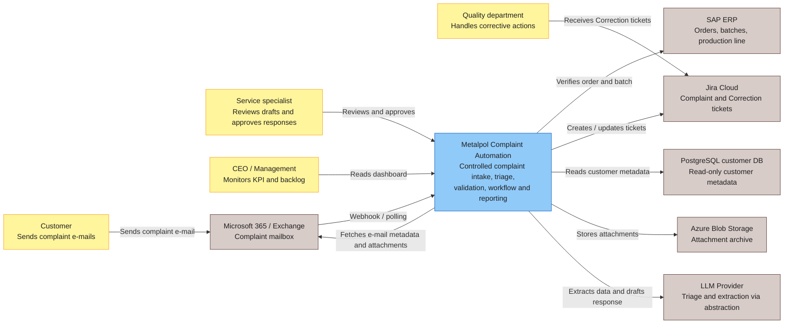
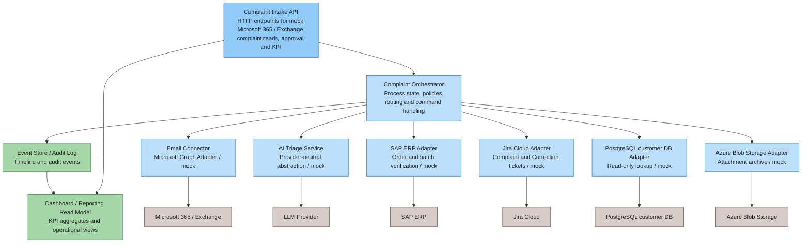
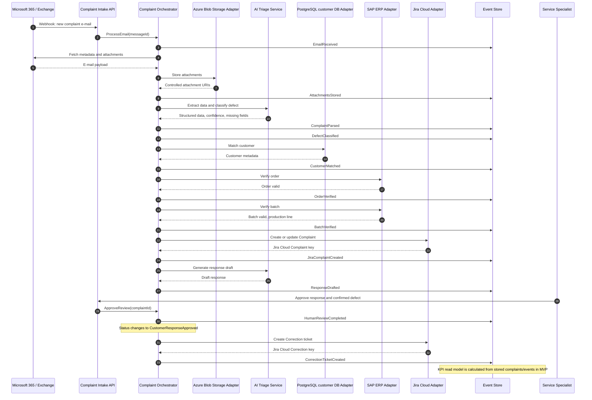
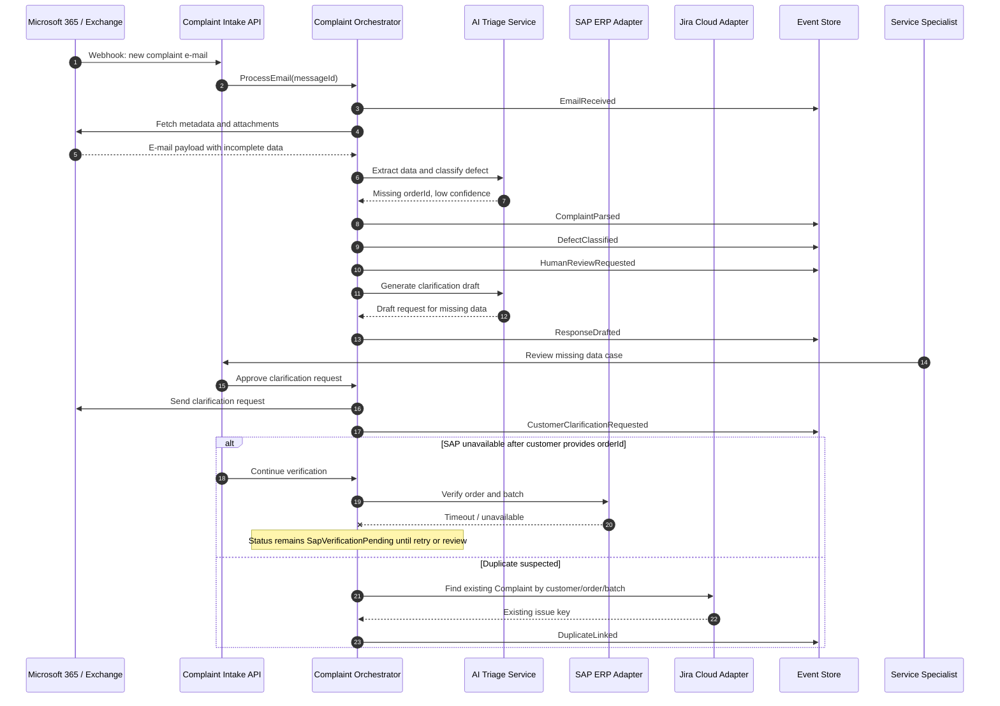

# Specyfikacja rozwiązania

## Executive summary

Proponowane rozwiązanie automatyzuje intake i koordynację procesu reklamacyjnego Metalpolu bez przenoszenia finalnej decyzji reklamacyjnej na AI. System ma skrócić czas od wpływu maila do utworzenia sprawy, ograniczyć ręczne przepisywanie danych, ujednolicić klasyfikację wad, zapewnić walidację w SAP ERP oraz dać zarządowi mierzalny dashboard KPI.

Architektura składa się z API reklamacyjnego, adapterów integracyjnych, komponentu AI triage, orchestratora procesu, event store / audit log oraz reporting read model. W MVP wszystkie integracje zewnętrzne są mockowane, ale kontrakty i odpowiedzialności komponentów powinny być zaprojektowane tak, aby zespół .NET mógł później zastąpić mocki adapterami produkcyjnymi.

Kluczowa decyzja: AI jest komponentem pomocniczym do ekstrakcji, klasyfikacji, streszczania i generowania draftu odpowiedzi. Źródłami prawdy pozostają SAP ERP, PostgreSQL customer DB, Jira Cloud, orchestrator procesu oraz decyzje człowieka.

## Zakres rozwiązania

W zakresie projektowanego MVP:

- przyjęcie przykładowej wiadomości reklamacyjnej przez mock Microsoft 365 / Exchange endpoint,
- utworzenie rekordu reklamacji,
- zapis załączników jako fake URI,
- deterministyczna ekstrakcja danych przez mock AI triage,
- walidacja klienta, orderu i batcha przez mock adaptery,
- utworzenie mock ticketu `Complaint` w Jira Cloud,
- wygenerowanie draftu odpowiedzi,
- skierowanie sprawy do `HumanReviewRequired` dla wyjątków,
- zatwierdzenie sprawy przez endpoint review,
- utworzenie mock ticketu `Correction`,
- timeline eventów oraz podstawowy dashboard KPI.

Poza zakresem MVP:

- produkcyjne połączenia z Microsoft Graph, SAP ERP, Jira Cloud, PostgreSQL customer DB i Azure Blob Storage,
- prawdziwy model LLM,
- automatyczne podejmowanie finalnych decyzji reklamacyjnych,
- pełny UI operacyjny,
- produkcyjne mechanizmy bezpieczeństwa, retencji, monitoringu i alertingu.

## 10. Kluczowe elementy specyfikacji

Ta sekcja zbiera najważniejsze decyzje projektowe. Jej celem jest pokazanie, że rozwiązanie nie jest "wdrożeniem AI", tylko kontrolowaną automatyzacją procesu reklamacyjnego.

### 10.1. Business objective

Celem rozwiązania jest skrócenie czasu pierwszej odpowiedzi, ograniczenie ręcznego przepisywania danych, ujednolicenie klasyfikacji reklamacji, zintegrowanie SAP ERP, Jira Cloud i Microsoft 365 / Exchange oraz zapewnienie CEO widoczności operacyjnej procesu reklamacji.

Automatyzacja ma sens tylko wtedy, gdy mapuje się na konkretny problem biznesowy: opóźnienia, backlog, niespójne kategorie, brak metryk, ręczną pracę między systemami i ryzyko utraty kontekstu sprawy.

### 10.2. System boundaries

Granice odpowiedzialności są celowe:

- SAP ERP nie jest zastępowany; pozostaje źródłem prawdy dla orderów, batchy i danych produkcyjnych.
- Jira Cloud nie jest zastępowana; pozostaje operacyjnym systemem ticketów `Complaint` i `Correction`.
- Microsoft 365 / Exchange nie jest zastępowany; pozostaje kanałem wejścia reklamacji.
- Excel wypada z procesu jako system operacyjny, ponieważ nie daje spójnego statusu, audytu ani KPI.
- Complaint Orchestrator trzyma stan procesu, reguły przejść, idempotencję i audit trail.
- AI nie jest źródłem prawdy; zwraca sugestie, które są walidowane przez system i człowieka.

Trade-off: takie granice ograniczają "magiczność" rozwiązania, ale zwiększają wiarygodność, audytowalność i możliwość wdrożenia w realnej organizacji.

### 10.3. Main flow

Poniższy flow pokazuje biznesowy przebieg procesu oraz aktualne nazwy eventów/statusów używane w MVP. Nazwy w kolumnie MVP są spójne z domain events i timeline API.

| Business milestone | MVP event/status | Odpowiedzialność |
|---|---|---|
| Nowy e-mail reklamacyjny wykryty | `EmailReceived` | Microsoft 365 / Exchange Adapter + Orchestrator |
| Rekord procesu reklamacji istnieje | status `Received` / `IntakeQueued` | Complaint Orchestrator |
| Załączniki zarchiwizowane | `AttachmentsStored` | Azure Blob Storage Adapter |
| Triage AI zakończony | `ComplaintParsed`, `DefectClassified` | AI Triage Service + schema validation |
| Klient dopasowany | `CustomerMatched` | PostgreSQL customer DB Adapter |
| Order zweryfikowany | `OrderVerified` | SAP ERP Adapter |
| Batch zweryfikowany | `BatchVerified` | SAP ERP Adapter |
| Ticket reklamacyjny utworzony | `JiraComplaintCreated` | Jira Cloud Adapter |
| Draft odpowiedzi gotowy | `ResponseDrafted` | AI Triage Service + Orchestrator |
| Człowiek wykonał review | `HumanReviewCompleted` | Service specialist |
| Klient otrzymał zatwierdzoną odpowiedź | poza zakresem MVP; w MVP widoczny jest status `CustomerResponseApproved` | Service specialist / future mail sender |
| Correction utworzone, jeśli potrzebne | `CorrectionTicketCreated` | Jira Cloud Adapter |
| Metryki zaktualizowane | Reporting read model liczony z eventów i statusów | Dashboard / Reporting Read Model |

Trade-off: MVP pokazuje pełny pipeline i audit trail bez produkcyjnej wysyłki maila do klienta. Produkcyjny krok powiadomienia klienta powinien być osobnym, idempotentnym adapterem.

### 10.4. AI boundary

Najważniejsza zasada projektowa:

> AI handles uncertainty in language. The system handles certainty in process.

Po polsku: AI obsługuje nieustrukturyzowany język. System obsługuje stan, reguły, integracje, audyt i odpowiedzialność biznesową.

AI może:

- wyciągnąć z maila `orderNumber`, opis, język, kategorię wady, confidence i brakujące pola,
- streścić sprawę dla specjalisty,
- przygotować draft odpowiedzi,
- zasygnalizować ryzyka, np. niską pewność albo prompt injection.

AI nie może:

- potwierdzić danych SAP ERP,
- utworzyć finalnej decyzji reklamacyjnej,
- wysłać odpowiedzi do klienta bez zatwierdzenia,
- zmienić stanu procesu bez deterministycznej logiki orchestratora,
- zastąpić audit logu, polityk dostępu, retry, rate limiting ani KPI.

Trade-off: ograniczenie roli AI zmniejsza zakres automatyzacji, ale chroni proces przed halucynacjami, błędnymi obietnicami i brakiem odpowiedzialności.

### 10.5. Human-in-the-loop

Człowiek nie jest "fallbackiem, bo AI może się mylić". Człowiek jest właścicielem decyzji biznesowej w sytuacjach, w których automatyzacja nie powinna działać samodzielnie.

`HumanReviewRequired` jest wymagane, gdy:

- `confidence < 0.85`,
- brakuje numeru zamówienia,
- SAP ERP nie znajduje orderu lub batcha,
- wykryto albo podejrzano duplikat,
- AI wykryło prompt injection,
- reklamacja dotyczy materiału lub wymiarów i ma potencjalnie wysoki wpływ jakościowy,
- mail zawiera wiele spraw naraz,
- zdjęcia są nieczytelne albo brakuje załączników wymaganych do oceny.

Trade-off: human review zostawia część pracy człowiekowi, ale usuwa z jego dnia pracę niskiej wartości: przepisywanie, zakładanie ticketów, szukanie danych i ręczne składanie kontekstu sprawy.

### 10.6. Observability

Proces musi być obserwowalny od pierwszej wersji, ponieważ jeden z głównych problemów CEO to brak metryk, a nie brak samego narzędzia AI.

Minimalny audit log i read model powinny przechowywać:

- eventy timeline'u,
- `correlationId`,
- `sourceMessageId`,
- `complaintId`,
- Jira Cloud issue key dla `Complaint` i `Correction`,
- SAP ERP `orderId` i `batchId`,
- AI model version i prompt version w produkcji,
- confidence score i `missingFields`,
- decyzję osoby wykonującej human review i jej identyfikator,
- timestampy potrzebne do KPI: ingest, parsing, SAP verification, Jira creation, draft response, human review, correction.

Trade-off: observability zwiększa ilość danych operacyjnych, ale bez niej nie da się potwierdzić poprawy KPI, debugować edge case'ów ani rozmawiać z managementem o efekcie automatyzacji.

## Proponowana architektura

### Complaint Intake API

Publiczna warstwa wejścia do MVP. Udostępnia endpointy do przyjęcia mock wiadomości, odczytu reklamacji, timeline'u, approval i KPI.

Przykładowe endpointy:

- `POST /api/mock/exchange/messages`,
- `GET /api/complaints/{id}`,
- `GET /api/complaints/{id}/timeline`,
- `POST /api/complaints/{id}/review/approve`,
- `GET /api/dashboard/kpis`.

Odpowiedzialności:

- walidacja podstawowego requestu,
- przekazanie komendy do orchestratora,
- zwracanie czytelnego statusu sprawy,
- brak logiki integracyjnej w kontrolerach.

### Email Connector / Microsoft Graph Adapter

Adapter odpowiedzialny za kanał wejścia e-mail. W MVP działa jako mock, ale kontrakt powinien odzwierciedlać przyszłą integrację z Microsoft Graph.

Odpowiedzialności:

- obsługa eventu nowej wiadomości,
- pobranie metadanych e-maila,
- pobranie załączników,
- deduplikacja po `messageId`,
- przygotowanie danych do intake.

W produkcji adapter powinien wspierać webhook oraz fallback polling.

### AI Triage Service

Komponent odpowiedzialny za deterministyczny mock ekstrakcji i klasyfikacji w MVP. W produkcji powinien być ukryty za provider-neutral interfejsem.

Odpowiedzialności:

- wykrycie języka,
- ekstrakcja `orderId`,
- streszczenie opisu reklamacji,
- zaproponowanie `defectCategory`,
- zwrócenie `missingFields`,
- zwrócenie `confidenceScore`,
- przygotowanie draftu odpowiedzi.

Ten komponent nie podejmuje finalnej decyzji reklamacyjnej.

### SAP ERP Adapter

Adapter do walidacji orderu i batcha. W MVP mockuje odpowiedzi SAP ERP.

Odpowiedzialności:

- sprawdzenie istnienia orderu,
- sprawdzenie batcha,
- zwrócenie production line, jeżeli dostępna,
- obsługa braku danych i niedostępności SAP ERP,
- raportowanie `SapMismatchDetected` albo statusu `SapVerificationPending`.

SAP ERP pozostaje źródłem prawdy dla orderów i batchy.

### Jira Cloud Adapter

Adapter odpowiedzialny za operacyjny workflow ticketów.

Odpowiedzialności:

- utworzenie lub aktualizacja ticketu `Complaint`,
- utworzenie ticketu `Correction` po zatwierdzeniu defektu,
- idempotencja po `complaintId`,
- raportowanie błędów tworzenia ticketów,
- przechowywanie kluczy Jira Cloud w rekordzie reklamacji.

Jira Cloud pozostaje systemem pracy operacyjnej, ale nie jest jedynym źródłem pełnego audytu procesu.

### PostgreSQL customer DB Adapter

Adapter read-only do danych klienta.

Odpowiedzialności:

- dopasowanie klienta po e-mailu, domenie, numerze klienta lub orderze,
- zwrócenie metadanych klienta potrzebnych do triage,
- oznaczenie braku dopasowania jako powodu do manual review,
- brak zapisu do bazy klientów.

PostgreSQL customer DB pozostaje źródłem prawdy dla metadanych klienta.

### Azure Blob Storage Adapter

Adapter odpowiedzialny za archiwizację załączników.

Odpowiedzialności:

- zapis zdjęć wad,
- zwrot kontrolowanych URI,
- oddzielenie binarnych załączników od rekordu reklamacji,
- przygotowanie miejsca pod retencję i kontrolę dostępu.

W MVP URI mogą być fikcyjne, ale powinny wyglądać jak stabilny kontrakt.

### Complaint Orchestrator

Centralny komponent aplikacyjny koordynujący proces. To tutaj znajduje się stan procesu, reguły przejść i decyzje o routingach.

Odpowiedzialności:

- utworzenie reklamacji,
- koordynacja adapterów,
- podejmowanie deterministycznych decyzji procesowych,
- obsługa human review,
- idempotencja komend,
- zapis eventów do audit log,
- aktualizacja statusu reklamacji.

Orchestrator nie powinien zawierać kodu konkretnego dostawcy LLM, SAP ERP, Jira Cloud ani Azure Blob Storage.

### Event Store / Audit Log

Źródło audytu procesu reklamacyjnego.

Odpowiedzialności:

- zapis zdarzeń timeline'u,
- umożliwienie odtworzenia historii sprawy,
- dostarczenie danych dla KPI,
- wsparcie debugowania i rozmów z klientem,
- przechowywanie timestampów kluczowych etapów.

W MVP event store może być in-memory. W produkcji powinien być trwały.

### Dashboard / Reporting Read Model

Read model do metryk i widoków zarządczych.

Odpowiedzialności:

- agregacja KPI,
- liczenie backlogu,
- liczenie SLA breach count,
- raportowanie kategorii wad, batchy i linii produkcyjnych,
- pokazywanie stabilności integracji SAP ERP i Jira Cloud,
- oddzielenie zapytań raportowych od logiki procesu.

## C4-style system context

## Container / component diagram

## Sequence diagram: happy path

## Sequence diagram: missing data / human review path

## Data ownership

| Obszar danych | Źródło prawdy | Odpowiedzialność w rozwiązaniu | Uwagi |
|---|---|---|---|
| Orders and batches | SAP ERP | `SAP ERP Adapter` tylko odczytuje i waliduje dane | Orchestrator nie nadpisuje danych SAP ERP |
| Customer metadata | PostgreSQL customer DB | `PostgreSQL customer DB Adapter` wykonuje read-only lookup | Brak zapisu do bazy klientów w MVP |
| Operational workflow | Jira Cloud | `Jira Cloud Adapter` tworzy i aktualizuje `Complaint` oraz `Correction` | Jira Cloud jest miejscem pracy operacyjnej, nie pełnym audytem procesu |
| Process state and audit | Complaint Orchestrator + Event Store | Orchestrator zarządza statusem i zapisuje zdarzenia | To główne źródło timeline'u reklamacji i KPI |
| Attachments | Azure Blob Storage | `Azure Blob Storage Adapter` przechowuje zdjęcia i zwraca kontrolowane URI | Rekord reklamacji nie przechowuje plików binarnych |
| AI suggestions | AI Triage Service | AI zwraca sugestie, confidence i drafty | Sugestie nie są finalną decyzją reklamacyjną |
| Reporting aggregates | Dashboard / Reporting Read Model | Read model agreguje KPI z eventów | Raportowanie nie powinno modyfikować procesu |

## Design principles

### Event-driven where useful

Zdarzenia powinny opisywać ważne fakty procesu, np. `EmailReceived`, `ComplaintParsed`, `DefectClassified`, `OrderVerified`, `HumanReviewRequested`, `CorrectionTicketCreated`. Nie każda metoda musi emitować event, ale każdy krok istotny dla audytu, SLA lub KPI powinien być widoczny w timeline.

Trade-off: event-driven ułatwia audyt i raportowanie, ale zwiększa złożoność względem prostego CRUD. W MVP można zacząć od prostego in-memory event log, zachowując nazwy i semantykę zdarzeń.

### Human-in-the-loop

Człowiek zatwierdza odpowiedzi i decyzje reklamacyjne, szczególnie przy brakujących danych, niskim confidence, SAP ERP mismatch, podejrzeniu duplikatu i sprawach wysokiego ryzyka.

Trade-off: human review ogranicza ryzyko błędów, ale nie usuwa całej pracy manualnej. Celem jest skierowanie uwagi specjalisty na wyjątki i decyzje, a nie na przepisywanie danych.

### Idempotency

Komendy powinny być bezpieczne przy powtórzeniu. `messageId`, `complaintId` i klucze Jira Cloud powinny zapobiegać tworzeniu duplikatów po retry.

Przykłady:

- ten sam `messageId` nie tworzy drugiej reklamacji,
- ponowne utworzenie `Complaint` zwraca istniejący Jira Cloud key,
- ponowne approval nie tworzy drugiego `Correction`.

### Retry/backoff

Integracje zewnętrzne powinny mieć retry z backoffem i stanem pośrednim. Dla SAP ERP sensowny status to `SapVerificationPending`; dla Jira Cloud błąd utworzenia ticketu powinien być widoczny w timeline i KPI.

Trade-off: retry poprawia odporność, ale bez idempotency może tworzyć duplikaty. Dlatego retry i idempotency muszą być projektowane razem.

### No secrets in code

Sekrety, tokeny, connection stringi i klucze API nie mogą znajdować się w repozytorium. W MVP integracje są mockowane. W produkcji konfiguracja powinna pochodzić z bezpiecznego secret store lub zmiennych środowiskowych.

### Provider-neutral LLM abstraction

Kod aplikacyjny powinien zależeć od interfejsu `AI Triage Service`, a nie od konkretnego dostawcy LLM. Wynik AI powinien mieć stabilny kontrakt: dane strukturalne, confidence, missing fields i draft.

Trade-off: abstrakcja może ukrywać specyficzne funkcje dostawcy, ale zmniejsza vendor lock-in i ułatwia testy deterministyczne.

### Observability from day one

Od pierwszej wersji MVP system powinien zapisywać timeline i podstawowe metryki. Bez observability automatyzacja tylko przenosi problem z Excela do czarnej skrzynki.

Minimalny zestaw obserwowalności:

- correlation id / complaint id,
- event timeline,
- status reklamacji,
- błędy adapterów,
- time to ingest email,
- first response time,
- manual review reasons,
- SAP ERP i Jira Cloud success/failure rate.

## Wskazówki implementacyjne dla zespołu .NET

Proponowany podział projektów:

- `Metalpol.Complaints.Api` - kontrolery, DTO wejścia/wyjścia, konfiguracja API,
- `Metalpol.Complaints.Application` - orchestrator, use case'y, polityki, kontrakty portów,
- `Metalpol.Complaints.Domain` - encje, value objects, statusy, eventy domenowe,
- `Metalpol.Complaints.Infrastructure` - mock adaptery Microsoft 365 / Exchange, SAP ERP, Jira Cloud, PostgreSQL customer DB, Azure Blob Storage i AI,
- `Metalpol.Complaints.Tests` - testy deterministycznych scenariuszy pipeline'u.

Priorytet implementacji MVP:

1. Model statusów i event timeline.
2. Endpoint mock Microsoft 365 / Exchange.
3. Orchestrator happy path.
4. Mock AI triage z deterministycznymi odpowiedziami.
5. Mock adaptery SAP ERP, Jira Cloud, PostgreSQL customer DB i Azure Blob Storage.
6. Human review path.
7. KPI endpoint.
8. Testy dla happy path, missing data, low confidence, SAP ERP mismatch i duplicate suspected.
