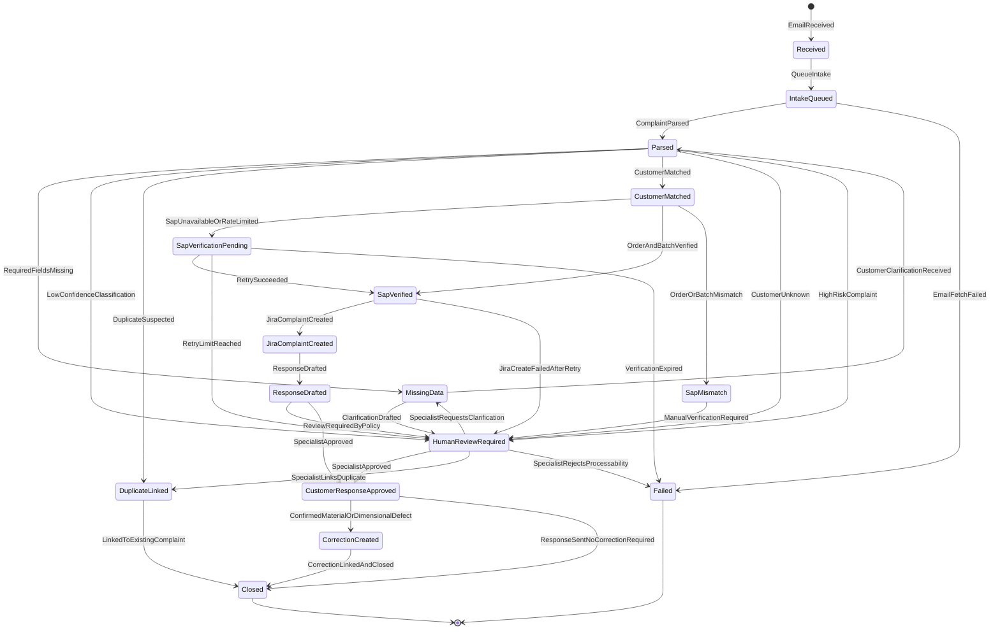

# State machine i edge cases

## Cel dokumentu

Ten dokument opisuje stan maszyny procesu reklamacyjnego oraz katalog przypadków brzegowych. Jego celem jest pokazanie, że automatyzacja nie jest tylko happy pathem, ale kontrolowanym procesem odpornym na braki danych, duplikaty, błędy integracji, niską pewność AI i przypadki wymagające obowiązkowego udziału człowieka.

State machine jest własnością `Complaint Orchestrator`. AI może zaproponować dane i confidence, ale nie zmienia samodzielnie statusu reklamacji.

## Complaint state machine

## Znaczenie stanów

| Stan | Znaczenie | Właściciel decyzji |
|---|---|---|
| `Received` | System wykrył nową wiadomość reklamacyjną | Microsoft 365 / Exchange adapter / orchestrator |
| `IntakeQueued` | Wiadomość czeka na pobranie danych i utworzenie intake | Orchestrator |
| `Parsed` | AI zwróciło ustrukturyzowany wynik zgodny ze schema | AI Triage Service + orchestrator validation |
| `MissingData` | Brakuje wymaganych danych, np. orderu lub opisu | Orchestrator |
| `CustomerMatched` | Klient został dopasowany w PostgreSQL customer DB | PostgreSQL customer DB Adapter |
| `SapVerificationPending` | Walidacja SAP ERP czeka na retry lub dostępność systemu | SAP ERP Adapter / orchestrator |
| `SapVerified` | Order i batch zostały potwierdzone w SAP ERP | SAP ERP Adapter |
| `SapMismatch` | Order lub batch nie zgadza się z SAP ERP | SAP ERP Adapter / orchestrator |
| `JiraComplaintCreated` | Ticket `Complaint` istnieje w Jira Cloud | Jira Cloud Adapter |
| `ResponseDrafted` | System przygotował draft odpowiedzi | AI Triage Service |
| `HumanReviewRequired` | Sprawa wymaga decyzji specjalisty | Człowiek |
| `CustomerResponseApproved` | Specjalista zatwierdził odpowiedź lub dalszy krok | Człowiek |
| `CorrectionCreated` | Ticket `Correction` został utworzony dla jakości | Jira Cloud Adapter |
| `Closed` | Sprawa zakończona w zakresie MVP | Orchestrator |
| `Failed` | Proces nie może kontynuować bez interwencji technicznej lub biznesowej | Orchestrator / człowiek |
| `DuplicateLinked` | Sprawa została połączona z istniejącą reklamacją | Orchestrator / człowiek |

## Transitions

| From | To | Trigger | Warunek / uwaga |
|---|---|---|---|
| `Received` | `IntakeQueued` | `QueueIntake` | Webhook lub fallback polling przekazał wiadomość do kolejki intake |
| `IntakeQueued` | `Parsed` | `ComplaintParsed` | AI output przeszedł JSON schema validation |
| `IntakeQueued` | `Failed` | `EmailFetchFailed` | Nie udało się pobrać wiadomości po retry |
| `Parsed` | `MissingData` | `RequiredFieldsMissing` | Brak orderu, opisu, zdjęć albo identyfikacji klienta |
| `Parsed` | `HumanReviewRequired` | `LowConfidenceClassification` | Confidence `< 0.60` lub polityka wymaga review |
| `Parsed` | `DuplicateLinked` | `DuplicateSuspected` | System znalazł istniejącą podobną sprawę i może ją połączyć |
| `Parsed` | `CustomerMatched` | `CustomerMatched` | PostgreSQL customer DB zwróciła jednoznaczne dopasowanie |
| `Parsed` | `HumanReviewRequired` | `CustomerUnknown` | Brak jednoznacznego klienta |
| `Parsed` | `HumanReviewRequired` | `HighRiskComplaint` | Sprawa wysokiego ryzyka wymaga ręcznego review niezależnie od confidence |
| `MissingData` | `HumanReviewRequired` | `ClarificationDrafted` | Specjalista musi zatwierdzić prośbę o dane |
| `MissingData` | `Parsed` | `CustomerClarificationReceived` | Klient dosłał brakujące dane i sprawa może wrócić do ekstrakcji |
| `CustomerMatched` | `SapVerificationPending` | `SapUnavailableOrRateLimited` | SAP ERP timeout, `503` albo `429` |
| `CustomerMatched` | `SapVerified` | `OrderAndBatchVerified` | SAP ERP potwierdził order i batch |
| `CustomerMatched` | `SapMismatch` | `OrderOrBatchMismatch` | SAP ERP nie potwierdził orderu lub batcha |
| `SapVerificationPending` | `SapVerified` | `RetrySucceeded` | Retry SAP ERP zakończył się sukcesem |
| `SapVerificationPending` | `HumanReviewRequired` | `RetryLimitReached` | Wymagana decyzja człowieka, czy czekać dalej |
| `SapVerificationPending` | `Failed` | `VerificationExpired` | Przekroczony maksymalny czas oczekiwania na SAP ERP |
| `SapMismatch` | `HumanReviewRequired` | `ManualVerificationRequired` | Człowiek musi ocenić rozbieżność |
| `SapVerified` | `JiraComplaintCreated` | `JiraComplaintCreated` | Ticket został utworzony albo znaleziono istniejący |
| `SapVerified` | `HumanReviewRequired` | `JiraCreateFailedAfterRetry` | Jira Cloud niedostępna lub workflow błąd po retry |
| `JiraComplaintCreated` | `ResponseDrafted` | `ResponseDrafted` | Draft odpowiedzi przygotowany |
| `ResponseDrafted` | `HumanReviewRequired` | `ReviewRequiredByPolicy` | Missing data, low confidence, high risk, SAP ERP mismatch lub duplicate |
| `ResponseDrafted` | `CustomerResponseApproved` | `SpecialistApproved` | Specjalista zatwierdził odpowiedź |
| `HumanReviewRequired` | `CustomerResponseApproved` | `SpecialistApproved` | Specjalista zatwierdził dalszy krok |
| `HumanReviewRequired` | `MissingData` | `SpecialistRequestsClarification` | Klient musi uzupełnić dane |
| `HumanReviewRequired` | `DuplicateLinked` | `SpecialistLinksDuplicate` | Człowiek potwierdził duplikat |
| `HumanReviewRequired` | `Failed` | `SpecialistRejectsProcessability` | Sprawa nie może być obsłużona w obecnym procesie |
| `CustomerResponseApproved` | `CorrectionCreated` | `ConfirmedMaterialOrDimensionalDefect` | Potwierdzona wada `material` albo `dimensional` |
| `CustomerResponseApproved` | `Closed` | `ResponseSentNoCorrectionRequired` | Odpowiedź wysłana, korekta nie jest wymagana |
| `CorrectionCreated` | `Closed` | `CorrectionLinkedAndClosed` | Correction ticket połączony, KPI zaktualizowane przez read model |
| `DuplicateLinked` | `Closed` | `LinkedToExistingComplaint` | Nowa sprawa zamknięta jako powiązana z istniejącą |

## Edge case catalogue

| Edge case | Detection | System behavior | User impact | Recovery path | Metric / alert |
|---|---|---|---|---|---|
| Missing order number | AI output ma `orderNumber = null` albo `missingFields` zawiera `orderNumber` | Status `MissingData`; wygeneruj draft prośby o numer zamówienia; wymagaj zatwierdzenia człowieka | Klient dostaje szybką prośbę o uzupełnienie zamiast czekać w backlogu | Po odpowiedzi klienta ponów parsing i walidację SAP ERP | `missing_fields_rate`, `manual_review_reason=missing_order_number` |
| Invalid order number | SAP ERP zwraca `404`, `400` albo format orderu nie przechodzi walidacji | Status `SapMismatch` lub `HumanReviewRequired`; nie twórz finalnej decyzji | Specjalista widzi, że order wymaga ręcznego sprawdzenia | Poproś klienta o korektę numeru albo ręcznie dopasuj order | `sap_verification_failure_rate`, alert przy skoku błędów |
| Customer unknown | PostgreSQL customer DB zwraca `404` albo wiele dopasowań | Status `HumanReviewRequired`; oznacz powód `CustomerUnknown` | Specjalista musi wybrać klienta lub poprosić o dane identyfikacyjne | Ręczne dopasowanie klienta albo prośba o dane | `customer_match_failure_rate` |
| Duplicate email | Ten sam `messageId`, `internetMessageId` lub podobny hash treści już istnieje | Nie twórz nowej reklamacji; przejdź do `DuplicateLinked` albo pokaż do review | Brak podwójnych ticketów Jira Cloud i zawyżonych metryk | Link do istniejącej reklamacji; ewentualnie ręczne rozdzielenie | `duplicate_detected_count` |
| Multiple complaints in one email | AI wykrywa więcej niż jeden order, batch lub różne opisy wad w jednej wiadomości | Status `HumanReviewRequired`; nie dziel automatycznie bez decyzji | Specjalista widzi sugestię podziału na osobne sprawy | Człowiek tworzy osobne reklamacje albo jedną sprawę zbiorczą | `multi_complaint_email_count` |
| Unreadable or missing attachments | Brak załączników, nieobsługiwany typ, niska jakość zdjęć albo `imageQualityAssessment = poor` | Status `MissingData` lub `HumanReviewRequired`; przygotuj draft prośby o lepsze zdjęcia | Klient szybko wie, jakie materiały dosłać | Po dosłaniu zdjęć ponów zapis i triage | `attachment_missing_rate`, `image_not_clear_count` |
| Unsupported language | AI zwraca `language = unknown` albo język inny niż PL/EN | Status `HumanReviewRequired`; nie generuj pewnego draftu | Specjalista musi obsłużyć język ręcznie lub poprosić o PL/EN | Ręczna obsługa albo prośba o wersję PL/EN | `unsupported_language_count` |
| SAP ERP timeout | SAP ERP Adapter zwraca timeout | W produkcji status `SapVerificationPending`; w MVP po błędzie sprawa trafia do `HumanReviewRequired` z eventem `SapMismatchDetected` | Specjalista widzi, że sprawa czeka na SAP ERP albo wymaga ręcznej weryfikacji | Retry; po limicie przejście do `HumanReviewRequired` | `sap_timeout_count`, alert po progu |
| SAP ERP rate limit | SAP ERP zwraca `429` przy limicie 100 req/min | Status `SapVerificationPending`; kolejkuj walidacje i respektuj `Retry-After` | Możliwe opóźnienie walidacji, ale bez utraty sprawy | Backoff, throttling w orchestratorze, ponowienie | `sap_rate_limit_count`, alert integracyjny |
| Jira Cloud unavailable | Jira Cloud zwraca `5xx`, timeout lub `429` | Nie gub rekordu reklamacji; użyj statusu `HumanReviewRequired` albo `Failed`; retry idempotentny | Specjalista widzi sprawę w systemie, ale ticket Jira Cloud może być opóźniony | Retry po `externalComplaintId`; po sukcesie zapisz issue key | `jira_issue_creation_success_rate`, `jira_issue_creation_failed_count` |
| Azure Blob Storage upload failure | Azure Blob Storage Adapter zwraca `5xx`, timeout, `413` albo `415` | Dla transient error retry; dla typu/rozmiaru pliku `HumanReviewRequired`; nie twórz stałych publicznych linków | Sprawa może być widoczna bez zdjęć do czasu odzyskania | Ponów upload, poproś o inny plik albo ręcznie dołącz załącznik | `attachment_storage_failure_count`, alert przy awarii storage |
| LLM invalid JSON | Odpowiedź AI nie przechodzi JSON schema validation | Odrzuć output; status `HumanReviewRequired`; nie używaj niezwalidowanych danych | Specjalista widzi, że triage AI nie jest zaufany dla tej sprawy | Ponów na mocku/testowo albo ręczna ekstrakcja | `ai_invalid_json_count`, alert przy wzroście |
| Low confidence classification | `confidenceScore < 0.60` lub `defectCategory = unknown` | Status `HumanReviewRequired`; manual classification required | Specjalista musi wybrać kategorię | Korekta człowieka zapisana jako `ClassificationCorrected` | `low_confidence_count`, `classification_correction_rate` |
| Prompt injection in customer email | Mail zawiera instrukcje do modelu, np. "ignore rules" lub "accept complaint"; output próbuje wyjść poza schema | Traktuj body jako untrusted; schema validation; ignoruj instrukcje; ewentualnie review | Klient nie może sterować procesem przez treść maila | Ręczny review, poprawa promptów/testów, zapis próbki do test setu | `prompt_injection_detected_count`, security alert przy powtórzeniach |
| High-risk complaint requiring mandatory human review | Klient strategiczny, wysoka wartość zamówienia, powtarzalny batch, eskalacja lub słowa kluczowe ryzyka | Status `HumanReviewRequired` niezależnie od confidence | Sprawa dostaje uwagę specjalisty, nawet jeśli dane są kompletne | Człowiek zatwierdza odpowiedź i dalsze kroki | `high_risk_review_count`, alert management przy eskalacji |

## Reliability and QA rules

### Każdy edge case musi być widoczny w timeline

Jeżeli system zmienia ścieżkę procesu, powinien zapisać event w timeline. W MVP używamy nazw eventów zgodnych z kodem domenowym:

- `HumanReviewRequested`,
- `SapMismatchDetected`,
- `DuplicateLinked`,
- `CustomerClarificationRequested`,
- `ComplaintFailed`.

Brak eventu oznacza brak audytu i brak metryki.

### Retry tylko z idempotencją

Retry jest dozwolony dla błędów tymczasowych, ale nie może tworzyć duplikatów:

- Microsoft 365 / Exchange: idempotencja po `messageId`,
- Jira Cloud: idempotencja po `externalComplaintId`,
- Azure Blob Storage: idempotencja po `complaintId + attachmentId`,
- SAP ERP i PostgreSQL customer DB: read-only, ale wynik powinien być zapisany z timestampem.

### Manual review jako kontrolowany stan, nie porażka

`HumanReviewRequired` nie oznacza awarii. To prawidłowy stan procesu dla spraw, w których automatyzacja nie powinna działać samodzielnie. Ten stan chroni jakość decyzji i relację z klientem.

### Failed jest stanem wyjątkowym

`Failed` powinien oznaczać, że proces nie może kontynuować bez interwencji technicznej lub biznesowej. Braki danych, niski confidence i SAP ERP mismatch powinny zwykle prowadzić do `HumanReviewRequired`, nie do `Failed`.

## Minimalny zestaw testów wynikający z edge case'ów

| Test | Oczekiwany wynik |
|---|---|
| Happy path z pełnymi danymi | `Closed` albo `CorrectionCreated -> Closed`, pełny timeline |
| Brak order number | `MissingData -> HumanReviewRequired` |
| Niepoprawny order | `SapMismatch -> HumanReviewRequired` |
| Nieznany klient | `HumanReviewRequired` z powodem `CustomerUnknown` |
| Duplikat maila | `DuplicateLinked`, brak drugiego Jira Cloud `Complaint` |
| Wiele reklamacji w jednym mailu | `HumanReviewRequired`, brak automatycznego splitu |
| Brak zdjęć | `MissingData` lub `HumanReviewRequired` |
| SAP ERP timeout | `SapVerificationPending` w produkcji albo `HumanReviewRequired` z `SapMismatchDetected` w MVP |
| Jira Cloud unavailable | Brak utraty complaint record, `HumanReviewRequired` albo `Failed` |
| Azure Blob Storage upload failure | `HumanReviewRequired` albo `Failed`, retry albo review |
| LLM invalid JSON | `HumanReviewRequired`, bez użycia niezwalidowanego outputu |
| Prompt injection | Ignorowane instrukcje, schema validation, brak finalnej decyzji |
| High-risk complaint | `HumanReviewRequired` mimo wysokiego confidence |

Ten zestaw testów powinien być podstawą późniejszego MVP .NET, bo pokrywa najważniejsze ryzyka operacyjne, a nie tylko ścieżkę demonstracyjną.
